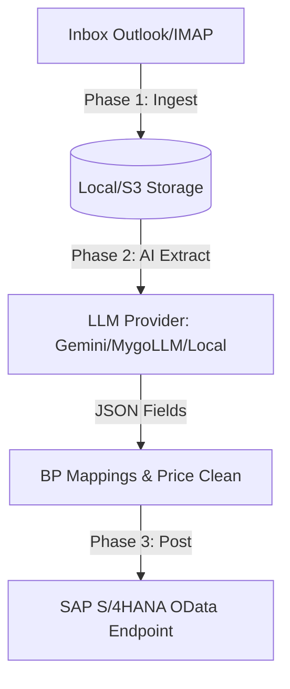

# DocSyncAI Knowledge Base Document

This document serves as the comprehensive technical reference for **DocSyncAI**, an automated system designed to bridge email inboxes with SAP S/4HANA systems by ingesting documents, extracting fields using Large Language Models (LLMs), and posting structured records directly to SAP.

---

## 1. Executive Summary & Purpose
DocSyncAI is a document processing automation pipeline. It solves the manual entry bottleneck of business-critical files (like vendor invoices and sales orders) coming into shared corporate mailboxes. 
- **Goal**: Automatically download attachments or email bodies, process them using AI to extract key invoice/sales-order fields in a standardized JSON schema, map values (like matching email addresses to SAP Business Partners), and create corresponding SAP records via OData APIs.
- **Scope**: Supports both local testing environments (using local PDF processing, local LLMs like Ollama, or mock endpoints) and enterprise production deployments (using Azure MSAL, cloud LLMs like Google Gemini, and secure SAP ERP OData connections).

---

## 2. Technical Stack
DocSyncAI is built on a modern decoupled architecture:

### Frontend
- **Framework**: Vite + React (v18.x) + TypeScript.
- **UI Components**: shadcn/ui (Tailwind CSS, Radix UI primitives) and Lucide React icons.
- **State & Data Fetching**: React Hooks, fetch API.
- **Routing**: React Router DOM.
- **Notifications**: Sonner toasts.

### Backend
- **Platform**: Node.js (ES Modules, `"type": "module"`).
- **Web Server**: Express.js (v4.x) with CORS enabled.
- **Process Manager**: PM2 (production clustering/daemonizer).

### Data & AI Processing Layer
- **LLM Integrations**:
  - **Google Gemini**: Integrates with `@google/genai` (supporting models like `gemini-3.5-flash`).
  - **OpenAI & Anthropic Claude**: Standard REST integration.
  - **Local LLM (Ollama)**: Connects directly to a local Ollama server running on port `11434` (using models like `gemma4:e4b`).
  - **Mygo LLM**: Integrates with the Mygo FastAPI Gateway (port `8000` / `443` in prod) via secure `X-API-Key` headers to enforce auditing and limit checks.
- **Document Text & OCR Extraction**:
  - **PDFs**: `pdfjs-dist/legacy/build/pdf.mjs` (for parsing native PDF text streams).
  - **Word Docs**: `word-extractor` and `mammoth` (for extracting DOC/DOCX body text).
  - **Images**: `tesseract.js` (for performing local Optical Character Recognition on PNG, JPG, JPEG, TIFF, and WebP).

### Email & Authentication Layer
- **Microsoft Outlook**: Graph API connection authenticated via OAuth 2.0 Client Credentials flow using Azure App Registrations and `@azure/msal-node`.
- **Standard Mail (Gmail/IMAP)**: Connects via the Node.js `imap` library and parses emails using `mailparser`.

---

## 3. Architecture & Data Pipelines
The application executes document processing in three main sequential phases. These can be run in real-time via background cron workers or manually triggered via one-shot CLI commands.



### Phase 1: Ingestion
1. Connects to Outlook (via Graph API) or Gmail (via IMAP) utilizing credentials defined in settings.
2. Scans incoming unread mail for keyword matches (e.g., "PO", "Sales Order", "Vendor Invoice").
3. Saves matching documents into the raw storage directory under `pdfdownloads/`.
4. Extracts email headers (Subject, From, Date, Domain, etc.) and saves them as JSON metadata inside `pdfdownloadsmetadata/`.
5. Marks parsed emails as read in the mailbox.

### Phase 2: AI Analysis & Post-Processing
1. Iterates through pending documents in the download directory.
2. Extracts raw text depending on file extension (PDF parse, Word extract, or Image OCR).
3. Constructs a prompt detailing the target schema (JSON structure, data types, extraction instructions) and appends the extracted document text.
4. Makes a structured JSON request (forcing JSON mode) to the active LLM provider (Gemini, Ollama, Mygo LLM Gateway, etc.).
5. Parses the response JSON:
   - Normalizes dates into `YYYY-MM-DD`.
   - Cleans unit prices and line amounts of formatting characters.
   - Maps sender email domains to SAP Business Partner numbers (e.g. mapping `rohit.jadhav@mygoconsulting.com` to customer code `BP-CUST`).
6. Saves the generated JSON to `ready_for_sap/json/` and moves the PDF to `ready_for_sap/documents/`.

### Phase 3: SAP Posting
1. Reads structured JSON records inside the `ready_for_sap/json/` folder.
2. Authenticates against the SAP OData APIs (using OAuth 2.0 or Basic Auth configurations).
3. Performs a dynamic handshake (fetching CSRF security tokens) from the SAP Gateway.
4. Submits the document schema payload to SAP to create the transaction:
   - For Sales Orders: Posts to `ZSO_CREATE_SRV` services.
   - For Invoices: Posts to `API_CV_ATTACHMENT_SRV` services.
5. Uploads the original PDF file as a linked SAP attachment using binary payload streams.
6. Moves successfully processed files to `processed_archive/` or failed ones to `trash/`.

---

## 4. Local Folder Layout Mappings
When running in `local` storage mode (configured via `STORAGE_TYPE=local` in `.env`), DocSyncAI organizes documents under `backend/InovicePDFs/`:

| Folder Path | Description |
| :--- | :--- |
| `InovicePDFs/pdfdownloads/` | Stores raw downloaded PDF, Word, or text files during Ingestion. |
| `InovicePDFs/pdfdownloadsmetadata/` | Stores extracted email header JSON metadata matching the downloads. |
| `InovicePDFs/ready_for_sap/documents/` | Store processed documents ready to be posted as attachments in SAP. |
| `InovicePDFs/ready_for_sap/json/` | Stores structured extraction JSON data parsed by the LLMs. |
| `InovicePDFs/processed_archive/` | Archival storage for successfully processed files. |
| `InovicePDFs/trash/` | Quarantine folder for spam, failed extractions, or rejected files. |

---

## 5. Configuration & Settings Schema
Settings are managed in the backend via a JSON database file `backend/settings.json`.

### Core Settings Attributes
- `active_provider`: Current LLM provider (e.g., `'Gemini'`, `'LocalLLM'`, `'MygoLLM'`).
- `gemini_api_key`, `localllm_api_key`, `mygollm_api_key`: API keys or gateway URL endpoints.
- `mygollm_url`: Endpoint for the Mygo FastAPI LLM Gateway (defaults to `http://ec2-34-224-26-117.compute-1.amazonaws.com`).
- `emails`: Array of mailbox ingestion configs (email address, provider type, credentials).
- `bp_mappings`: Mapping table array linking sender emails/domains to SAP Business Partner codes and Sales Organizations.
- `calculate_price_formula` / `price_formula_type`: Formulas for programmatic unit price resolution.

---

## 6. How to Use & CLI Commands
The application provides a CLI master controller (`backend/app.js`) to run operations:

```bash
# Start backend Express server on port 8000 (also runs the background 5-minute scheduler)
node app.js server

# Run Phase 1 (Mailbox Ingestion) once
node app.js phase1

# Run Phase 2 (AI Extraction & Normalization) once
node app.js phase2

# Run Full Synchronization once (runs Phase 1 immediately followed by Phase 2)
node app.js sync
```

### Development Environment Commands
```bash
# Start backend in watch-restart mode
cd backend
npm run dev

# Start frontend Vite development server (port 5173 / 8080)
cd ..
npm run dev
```

---

## 7. RAG Chunking / Querying Index Tips
If index-feeding this document to a RAG agent:
- **Querying tech stack?** Look under Section 2.
- **Debugging file paths?** Refer to the Folder layout table in Section 4.
- **Adding new LLM providers?** Section 3 (Phase 2) and Section 5 illustrate how models are evaluated, prompts are formatted, and parameters like `json_mode` are configured.
- **Understanding SAP integrations?** Check Section 3 (Phase 3) details on OData dynamic CSRF handshakes and attachment routing.
