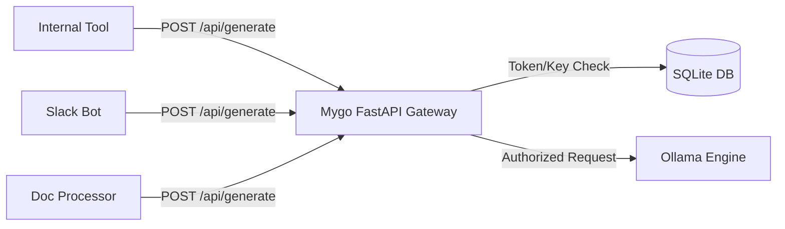

# Mygo LLM Platform: Application Integration Guide

This guide explains how external applications in the MYGO ecosystem can integrate with and consume the local LLM services provided by the Mygo LLM platform.

---

## 1. Overview of the Integration Architecture

Instead of applications communicating directly with Ollama (which runs without authorization controls on port `11434`), external apps route requests through the **FastAPI Gateway** on port `8000` (or HTTPS port `443` in production).



This gateway provides:
*   **Security**: Restricts access via API Keys (`X-API-Key` headers).
*   **Observability**: Logs every request's latency, prompt, response, status, and calling app name for centralized auditing.
*   **Rate & Configuration Limits**: Standardizes system prompts, model version mappings, and temperature defaults.

---

## 2. Generating an API Key

Before an application can call the LLM API, you must provision an API Key:
1. Access the **Mygo LLM Admin Portal**.
2. Navigate to the **App Keys** tab.
3. Click **Create New Application Key** and enter a name for the integrating application (e.g., `Slack Integrator`).
4. Copy the generated key. It will look like: `mygo_7d422a10bf8b...`. Keep this key secure as an environment variable in your client application.

---

## 3. API Specification: `POST /api/generate`

This endpoint accepts text generation requests, processes them via the configured local model, logs metrics, and returns the output.

### HTTP Headers
```http
Content-Type: application/json
X-API-Key: <YOUR_MYGO_API_KEY>
```

### Request Body (JSON)
| Field | Type | Required | Default | Description |
| :--- | :--- | :--- | :--- | :--- |
| `prompt` | `string` | **Yes** | — | The text prompt/instruction for the LLM. |
| `system_prompt` | `string` | No | `null` | System/context instructions to shape the model's behavior/role. |
| `temperature` | `float` | No | `0.7` | Creativity parameter (higher = more creative, lower = more deterministic). |
| `json_mode` | `boolean` | No | `false` | If `true`, forces the LLM to return valid JSON output (requires prompt to mention JSON). |

### Response Body (JSON)
```json
{
  "output": "The text generated by the local LLM model.",
  "latency_ms": 2341
}
```

---

## 4. Code Integration Examples

````carousel
```bash
# Example using cURL
curl -X POST https://your-domain.com/api/generate \
  -H "Content-Type: application/json" \
  -H "X-API-Key: mygo_your_api_key_here" \
  -d '{
    "prompt": "Summarize the key benefits of using local LLMs.",
    "system_prompt": "You are a concise engineering assistant.",
    "temperature": 0.5
  }'
```
<!-- slide -->
```python
# Example using Python (requests)
import os
import requests

def generate_text(prompt: str, system_prompt: str = None) -> str:
    url = "https://your-domain.com/api/generate"
    headers = {
        "Content-Type": "application/json",
        "X-API-Key": os.getenv("MYGO_LLM_KEY")
    }
    payload = {
        "prompt": prompt,
        "system_prompt": system_prompt,
        "temperature": 0.7
    }
    
    try:
        response = requests.post(url, json=payload, headers=headers, timeout=60)
        response.raise_for_status()
        data = response.json()
        return data["output"]
    except requests.exceptions.RequestException as e:
        print(f"Integration error: {e}")
        return "Error calling Mygo LLM"
```
<!-- slide -->
```javascript
// Example using Node.js / JavaScript (fetch)
async function generateText(prompt, systemPrompt = null) {
  const url = "https://your-domain.com/api/generate";
  const apiKey = process.env.MYGO_LLM_KEY;

  try {
    const response = await fetch(url, {
      method: "POST",
      headers: {
        "Content-Type": "application/json",
        "X-API-Key": apiKey
      },
      body: JSON.stringify({
        prompt: prompt,
        system_prompt: systemPrompt,
        temperature: 0.7
      })
    });

    if (!response.ok) {
      throw new Error(`HTTP error! status: ${response.status}`);
    }

    const data = await response.json();
    return data.output;
  } catch (error) {
    console.error("LLM Generation Failed:", error);
    throw error;
  }
}
```
````

---

## 5. Advanced Feature: JSON Mode (Structured Outputs)

To integrate the LLM with automated backend workflows (e.g. data extraction, parsing, sentiment analysis), you can enforce structured JSON outputs by setting `"json_mode": true`.

> [!IMPORTANT]
> When using `json_mode: true`, you **MUST** explicitly instruct the model to return JSON in the prompt or system prompt, including the schema or keys you expect. Otherwise, the request may stall or fail.

### JSON Mode Request Example:
```json
{
  "prompt": "Extract the names and sentiment of users in this text: 'Alice loved the service, but Bob was highly disappointed.' Return format: { 'extractions': [ { 'name': string, 'sentiment': 'positive'|'negative' } ] }",
  "system_prompt": "You are a data extractor. Respond ONLY in valid JSON.",
  "json_mode": true
}
```

### JSON Mode Response:
```json
{
  "output": "{\n  \"extractions\": [\n    { \"name\": \"Alice\", \"sentiment\": \"positive\" },\n    { \"name\": \"Bob\", \"sentiment\": \"negative\" }\n  ]\n}",
  "latency_ms": 1820
}
```
*(You can then run `json.loads(response["output"])` directly in your code without regex cleanup!)*
