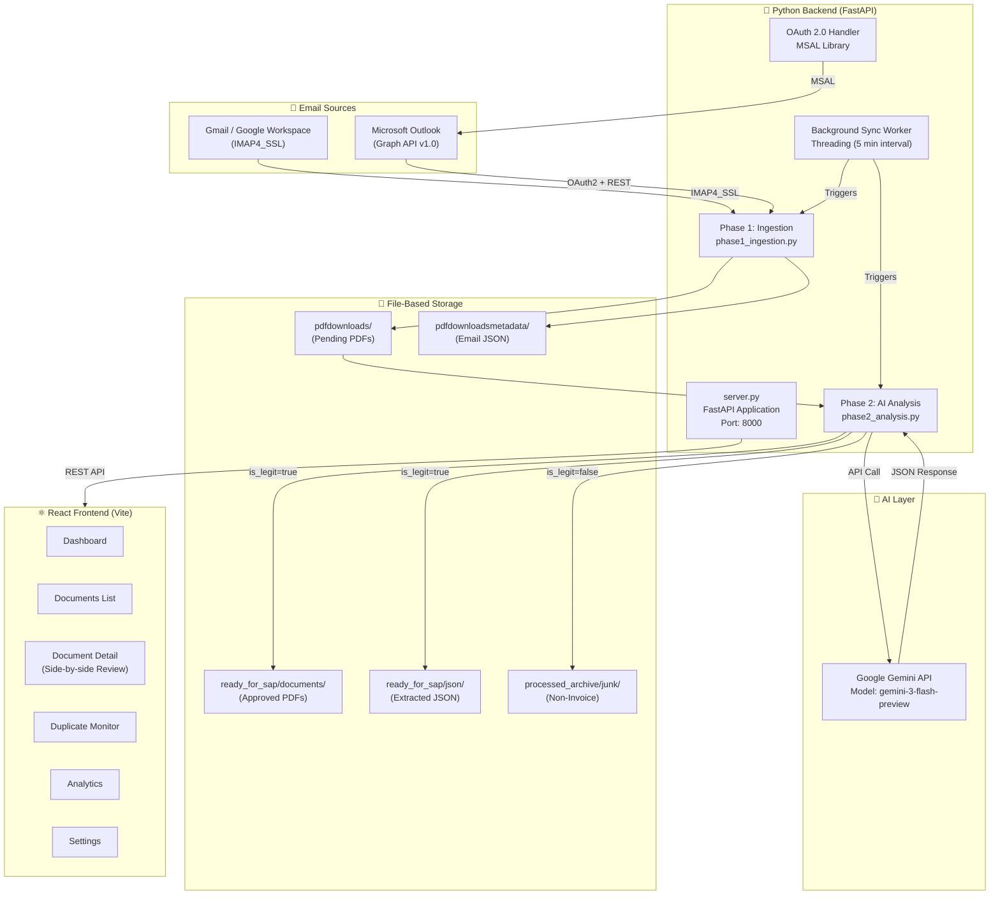
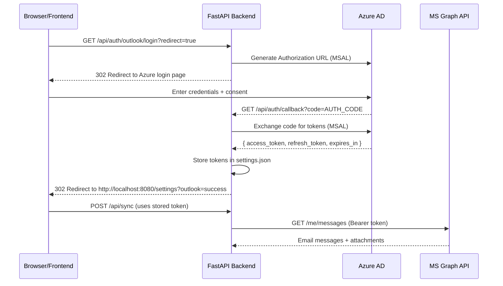
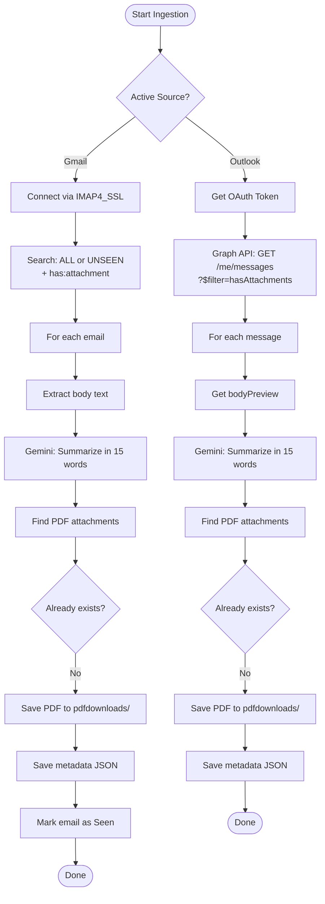
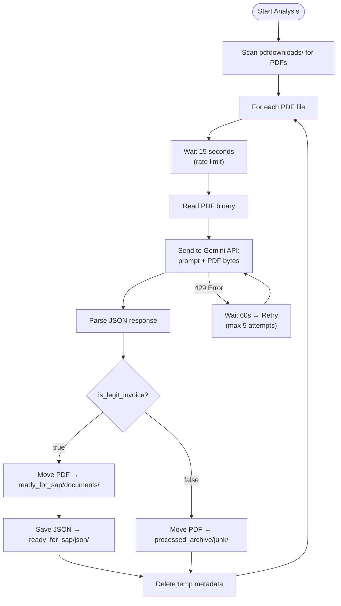
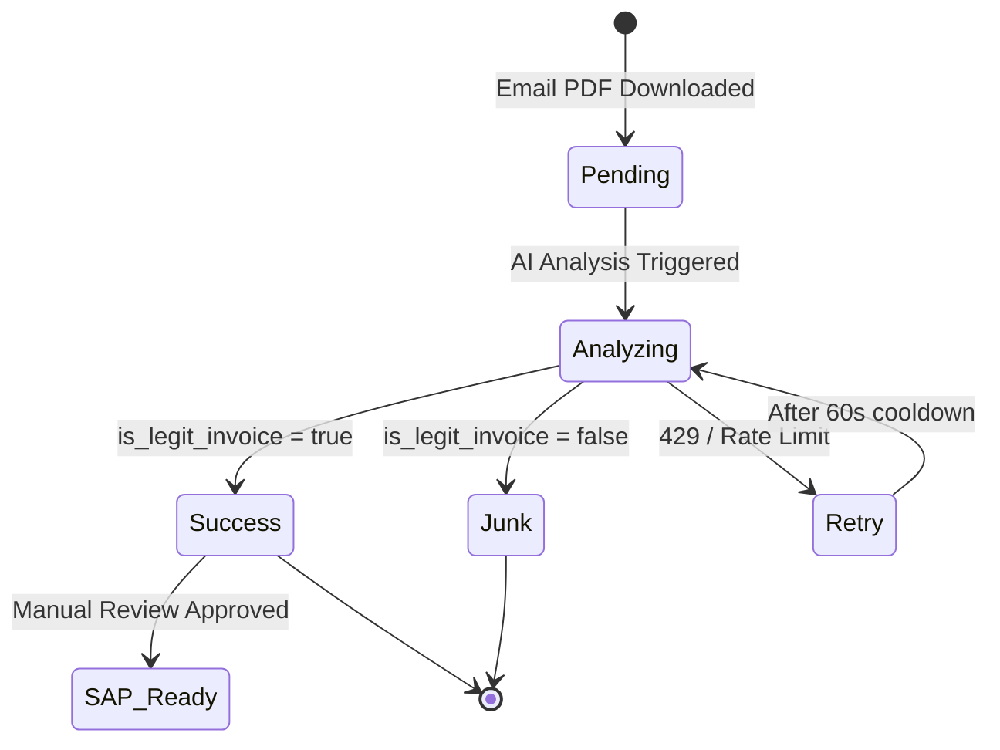

# MY DocSyncAI — Technical Specification Document

> **Version:** 1.0  
> **Date:** April 6, 2026  
> **Authors:** MyGo Consulting Engineering Team  
> **Application Name:** MY DocSyncAI  
> **Tagline:** Inbox to SAP Automation  

---

## Table of Contents

1. [Executive Summary](#1-executive-summary)
2. [System Architecture](#2-system-architecture)
3. [Technology Stack](#3-technology-stack)
4. [Frontend Specification](#4-frontend-specification)
5. [Backend Specification](#5-backend-specification)
6. [AI / Machine Learning Layer](#6-ai--machine-learning-layer)
7. [External API Integrations](#7-external-api-integrations)
8. [Data Models & Storage](#8-data-models--storage)
9. [REST API Reference](#9-rest-api-reference)
10. [Authentication & Security](#10-authentication--security)
11. [Processing Pipeline](#11-processing-pipeline)
12. [Environment Configuration](#12-environment-configuration)
13. [Deployment & Infrastructure](#13-deployment--infrastructure)
14. [Appendix: Dependency Manifest](#14-appendix-dependency-manifest)

---

## 1. Executive Summary

**MY DocSyncAI** is a full-stack document automation platform that bridges the gap between incoming email communications and SAP S/4HANA enterprise systems. It automates the ingestion of PDF attachments from corporate email inboxes (Gmail and Microsoft Outlook), performs AI-driven data extraction using Google's Gemini large language model, and presents the extracted data through a modern, interactive dashboard for human review before final SAP posting.

### Core Value Proposition

| Capability | Description |
|---|---|
| **Email Ingestion** | Automatic polling of Gmail (IMAP) and Outlook (Graph API) for PDF attachments |
| **AI-Powered Extraction** | Structured JSON extraction of invoice headers, line items, and totals using Gemini |
| **Manual Review Workbench** | Side-by-side PDF viewer with editable AI-extracted fields |
| **Duplicate Detection** | Configurable field-matching rules to flag duplicate documents |
| **SAP-Ready Output** | Clean, validated JSON output structured for SAP S/4HANA integration |
| **Real-time Analytics** | KPI dashboards, processing volume trends, and error breakdowns |

---

## 2. System Architecture



### Architecture Style

- **Pattern:** Client-Server with file-based persistence
- **Communication:** RESTful HTTP (JSON over HTTP)
- **Background Processing:** Python `threading.Thread` (daemon mode)
- **Frontend ↔ Backend:** CORS-enabled, same-machine deployment

---

## 3. Technology Stack

### 3.1 Languages

| Language | Version | Usage |
|---|---|---|
| **TypeScript** | 5.8.3 | Frontend application code, type-safe React components |
| **JavaScript (ES Modules)** | ES2022 | Vite configuration, ESLint config, PostCSS config |
| **Python** | 3.10+ | Backend server, AI integration, email processing |
| **HTML5** | — | Entry point (`index.html`), semantic markup |
| **CSS3** | — | Tailwind CSS utility classes, custom design tokens |

### 3.2 Frontend Frameworks & Libraries

| Technology | Version | Purpose |
|---|---|---|
| **React** | 18.3.1 | UI component library, declarative rendering |
| **Vite** | 5.4.19 | Build tool, dev server with HMR, ES module bundler |
| **@vitejs/plugin-react-swc** | 3.11.0 | SWC-based React Fast Refresh for Vite |
| **React Router DOM** | 6.30.1 | Client-side routing, URL-based navigation |
| **TanStack React Query** | 5.83.0 | Server state management, data fetching/caching |
| **Tailwind CSS** | 3.4.17 | Utility-first CSS framework |
| **tailwindcss-animate** | 1.0.7 | Animation utilities for Tailwind |
| **@tailwindcss/typography** | 0.5.16 | Prose/typography styling plugin |
| **PostCSS** | 8.5.6 | CSS transformation pipeline |
| **Autoprefixer** | 10.4.21 | Automatic vendor prefix insertion |

### 3.3 UI Component Library (shadcn/ui + Radix UI)

The application uses **shadcn/ui** as its design system, built on top of **Radix UI** headless primitives. This provides accessible, unstyled components that are fully customizable.

| Radix Primitive | Version | Component |
|---|---|---|
| `@radix-ui/react-accordion` | 1.2.11 | Accordion |
| `@radix-ui/react-alert-dialog` | 1.1.14 | Alert Dialog |
| `@radix-ui/react-avatar` | 1.1.10 | Avatar |
| `@radix-ui/react-checkbox` | 1.3.2 | Checkbox |
| `@radix-ui/react-dialog` | 1.1.14 | Dialog/Modal |
| `@radix-ui/react-dropdown-menu` | 2.1.15 | Dropdown Menu |
| `@radix-ui/react-hover-card` | 1.1.14 | Hover Card |
| `@radix-ui/react-label` | 2.1.7 | Form Label |
| `@radix-ui/react-popover` | 1.1.14 | Popover |
| `@radix-ui/react-progress` | 1.1.7 | Progress Bar |
| `@radix-ui/react-radio-group` | 1.3.7 | Radio Group |
| `@radix-ui/react-scroll-area` | 1.2.9 | Custom Scroll Area |
| `@radix-ui/react-select` | 2.2.5 | Select Dropdown |
| `@radix-ui/react-separator` | 1.1.7 | Visual Separator |
| `@radix-ui/react-slider` | 1.3.5 | Slider |
| `@radix-ui/react-slot` | 1.2.3 | Component Slot |
| `@radix-ui/react-switch` | 1.2.5 | Toggle Switch |
| `@radix-ui/react-tabs` | 1.1.12 | Tabs |
| `@radix-ui/react-toast` | 1.2.14 | Toast Notifications |
| `@radix-ui/react-toggle` | 1.1.9 | Toggle Button |
| `@radix-ui/react-toggle-group` | 1.1.10 | Toggle Group |
| `@radix-ui/react-tooltip` | 1.2.7 | Tooltip |

### 3.4 Additional Frontend Libraries

| Library | Version | Purpose |
|---|---|---|
| **Recharts** | 2.15.4 | Data visualization (Line, Bar, Pie charts) |
| **Lucide React** | 0.462.0 | Icon library (200+ SVG icons) |
| **Sonner** | 1.7.4 | Toast notification system |
| **React Hook Form** | 7.61.1 | Form state management |
| **@hookform/resolvers** | 3.10.0 | Zod/Yup schema validation resolvers |
| **Zod** | 3.25.76 | TypeScript-first schema validation |
| **date-fns** | 3.6.0 | Date utility functions |
| **react-day-picker** | 8.10.1 | Calendar/date picker component |
| **react-resizable-panels** | 2.1.9 | Resizable split panel layouts |
| **embla-carousel-react** | 8.6.0 | Touch-friendly carousel component |
| **cmdk** | 1.1.1 | Command palette (⌘K) |
| **input-otp** | 1.4.2 | OTP input component |
| **class-variance-authority** | 0.7.1 | Component variant management |
| **clsx** | 2.1.1 | Conditional className utility |
| **tailwind-merge** | 2.6.0 | Tailwind class conflict resolution |
| **vaul** | 0.9.9 | Drawer/sheet component |
| **next-themes** | 0.3.0 | Theme management (dark/light mode) |

### 3.5 Backend Frameworks & Libraries

| Library | Version | Purpose |
|---|---|---|
| **FastAPI** | ≥0.100.0 | Async Python web framework (REST API) |
| **Uvicorn** | ≥0.22.0 | ASGI server for FastAPI |
| **Pydantic** | ≥2.0.0 | Data validation & serialization |
| **python-dotenv** | ≥1.0.0 | `.env` file parsing |
| **google-genai** | ≥0.3.0 | Google Gemini API client SDK |
| **imaplib2** | ≥3.0.0 | IMAP email protocol client |
| **MSAL** | (latest) | Microsoft Authentication Library for OAuth 2.0 |
| **Requests** | (latest) | HTTP client for Microsoft Graph API calls |

### 3.6 Development & Testing Tools

| Tool | Version | Purpose |
|---|---|---|
| **ESLint** | 9.32.0 | JavaScript/TypeScript linting |
| **typescript-eslint** | 8.38.0 | TypeScript ESLint rules |
| **eslint-plugin-react-hooks** | 5.2.0 | React Hooks linting rules |
| **eslint-plugin-react-refresh** | 0.4.20 | React Refresh linting |
| **Vitest** | 3.2.4 | Unit testing framework |
| **@testing-library/react** | 16.0.0 | React component testing utilities |
| **@testing-library/jest-dom** | 6.6.0 | Custom Jest DOM matchers |
| **jsdom** | 20.0.3 | Browser environment simulation for tests |

### 3.7 Typography & Design

| Asset | Details |
|---|---|
| **Primary Font** | Inter (Google Fonts) |
| **Fallback Stack** | `'72'`, `-apple-system`, `BlinkMacSystemFont`, `'Segoe UI'`, `sans-serif` |
| **Design System** | SAP Fiori-inspired with custom CSS tokens |
| **Color Mode** | Dark mode supported via `class` strategy |
| **Radius System** | CSS custom property `--radius` with `lg`, `md`, `sm` variants |

---

## 4. Frontend Specification

### 4.1 Build Configuration

| Property | Value |
|---|---|
| **Bundler** | Vite 5.4.19 |
| **Dev Server Port** | `8080` |
| **Server Host** | `::` (all interfaces) |
| **HMR Overlay** | Disabled |
| **Path Alias** | `@` → `./src` |
| **Module Format** | ES Modules (`"type": "module"`) |

### 4.2 Application Pages

| Route | Component | Description |
|---|---|---|
| `/` | `Dashboard` | KPI tiles, line/pie charts, recent activity feed |
| `/dashboard` | `Dashboard` | Alias for root |
| `/documents` | `Documents` | Paginated document list with sync controls |
| `/documents/:id` | `DocumentDetail` | Side-by-side PDF viewer + AI extraction workbench |
| `/duplicate-monitor` | `DuplicateMonitor` | Duplicate detection table with compare view |
| `/analytics` | `Analytics` | Financial KPIs, volume trends, error breakdowns |
| `/settings` | `SettingsPage` | AI preferences, prompts, sources, roles, credits, users |
| `*` | `NotFound` | 404 catch-all route |

### 4.3 Component Architecture

```
src/
├── App.tsx                        # Root component with routing
├── main.tsx                       # React DOM entry point
├── index.css                      # Global styles & CSS custom properties
├── App.css                        # App-level styles
├── vite-env.d.ts                  # Vite type declarations
│
├── components/
│   ├── layout/
│   │   └── AppShell.tsx           # Shell bar + sidebar + main content layout
│   ├── dashboard/
│   │   └── KPITile.tsx            # Reusable KPI metric card
│   ├── common/
│   │   └── StatusBadge.tsx        # Status indicator badge (success/pending/error)
│   ├── NavLink.tsx                # Navigation link component
│   └── ui/                        # 49 shadcn/ui components
│       ├── accordion.tsx
│       ├── alert-dialog.tsx
│       ├── button.tsx
│       ├── card.tsx
│       ├── dialog.tsx
│       ├── select.tsx
│       ├── sidebar.tsx
│       ├── table.tsx
│       ├── tabs.tsx
│       ├── toast.tsx
│       ├── ... (39 more)
│       └── use-toast.ts
│
├── hooks/
│   ├── use-mobile.tsx             # Responsive breakpoint hook
│   └── use-toast.ts              # Toast notification hook
│
├── lib/
│   └── utils.ts                   # cn() utility (clsx + tailwind-merge)
│
├── pages/
│   ├── Dashboard.tsx              # Live stats dashboard
│   ├── Documents.tsx              # Document list + sync trigger
│   ├── DocumentDetail.tsx         # Detail view + PDF preview + extraction
│   ├── DuplicateMonitor.tsx       # Duplicate detection interface
│   ├── Analytics.tsx              # Financial analytics
│   ├── Settings.tsx               # Multi-tab settings (AI, prompts, sources, etc.)
│   ├── Index.tsx                  # Root redirect
│   └── NotFound.tsx               # 404 page
│
└── test/                          # Test files
```

### 4.4 Settings Module Breakdown

The Settings page contains 7 independent sub-modules:

| Tab | Component | Features |
|---|---|---|
| **AI Preferences** | `AIPreferences` | OpenAI, Claude (Anthropic), Gemini API key management with active provider selection |
| **Manage Prompts** | `ManagePrompts` | Editable system prompt for AI document analysis |
| **Manage Sources** | `ManageSources` | Gmail IMAP config + Outlook OAuth2 connection |
| **Duplicate Detection** | `DuplicateDetectionSettings` | Per-document-type field matching rules (PO, Sales Order) |
| **Manage Roles** | `ManageRoles` | Administrator, Reviewer, Viewer role definitions |
| **AI Credits** | `ManageCredits` | Credit quota monitoring and enterprise upgrade CTA |
| **User Management** | `ManageUsers` | User table with role assignment and status tracking |

### 4.5 Data Visualization

The application uses **Recharts** for all charts:

| Chart Type | Location | Data Source |
|---|---|---|
| **Line Chart** | Dashboard | Processing volume trend (weekly) |
| **Donut (Pie) Chart** | Dashboard | Status distribution (Success/Failed/Pending/Duplicate) |
| **Bar Chart** | Analytics | Monthly processing volume |
| **Line Chart** | Analytics | Cycle time reduction trend |
| **Pie Chart** | Analytics | Error root cause breakdown |
| **Horizontal Bar Chart** | Analytics | Top suppliers/customers by volume |

---

## 5. Backend Specification

### 5.1 Server Architecture

| Property | Value |
|---|---|
| **Framework** | FastAPI |
| **ASGI Server** | Uvicorn |
| **Host** | `0.0.0.0` |
| **Port** | `8000` |
| **Hot Reload** | Enabled (via `uvicorn.run(reload=True)`) |
| **CORS** | All origins (`*`), all methods, all headers |
| **Static File Serving** | Mounted at `/api/pdf-docs` and `/api/pending-docs` |

### 5.2 Entry Points

| File | Role |
|---|---|
| `server.py` (722 lines) | Main FastAPI application — all API routes, email sync, AI analysis, OAuth2, background worker |
| `app.py` (77 lines) | CLI master controller — `server`, `phase1`, `phase2`, `sync` commands |
| `phase1_ingestion.py` (184 lines) | Standalone Gmail ingestion script with IMAP polling |
| `phase2_analysis.py` (164 lines) | Standalone AI analysis script with Gemini processing |
| `list_models.py` (16 lines) | Utility to list available Gemini models |

### 5.3 Background Sync Worker

The server spawns a daemon thread that runs a continuous sync loop:

```python
# Interval: Every 5 minutes (300 seconds)
# Initial delay: 10 seconds after server start
# Runs: Phase 1 (Ingestion) → Phase 2 (AI Analysis)
# Condition: Only if Gmail OR Outlook credentials are configured
```

| Property | Value |
|---|---|
| **Thread Type** | `threading.Thread` (daemon=True) |
| **Sync Interval** | 300 seconds (5 minutes) |
| **Startup Delay** | 10 seconds |
| **Logging** | Python `logging` module → `master.log` |

### 5.4 File-Based Storage Layout

```
backend/
└── InovicePDFs/
    ├── pdfdownloads/              # Newly ingested PDFs (pending analysis)
    │   └── downloaded_list.txt    # History log of downloaded filenames
    ├── pdfdownloadsmetadata/      # Email metadata JSON for each PDF
    ├── ready_for_sap/
    │   ├── documents/             # Approved PDFs (is_legit_invoice=true)
    │   └── json/                  # AI-extracted structured JSON per document
    └── processed_archive/
        └── junk/                  # Rejected PDFs (is_legit_invoice=false)
```

---

## 6. AI / Machine Learning Layer

### 6.1 Primary AI Model

| Property | Value |
|---|---|
| **Provider** | Google DeepMind |
| **Model ID** | `gemini-3.5-flash` |
| **SDK** | `@google/genai` Node.js SDK |
| **API Key Source** | `GEMINI_API_KEY` environment variable |
| **Response Format** | Structured JSON (`response_mime_type: 'application/json'`) |
| **Input Type** | Multimodal (text prompt + PDF binary via dynamic inlineData base64) |

### 6.2 Supported AI Providers (Configurable via Settings)

The frontend supports switching between three LLM providers. Currently, only Gemini is fully implemented in the backend.

| Provider | Model | Status |
|---|---|---|
| **Google Gemini** | `gemini-3.5-flash` (configurable) | ✅ Fully implemented |
| **OpenAI** | GPT-4 (configurable) | 🔧 UI ready, backend placeholder |
| **Anthropic (Claude)** | claude-sonnet-4-6 (configurable) | 🔧 UI ready, backend placeholder |

### 6.3 AI Use Cases

#### Use Case 1: Document Analysis & Data Extraction

The primary AI function. Accepts a PDF document binary and returns a structured JSON extraction.

**Input:**
- System prompt (customizable via Settings → Manage Prompts)
- PDF binary (`application/pdf` MIME type)

**Output Schema:**
```json
{
  "is_legit_invoice": true,
  "total_pages_detected": 2,
  "header": {
    "context": "Purchase Order",
    "purchase_order_number": "PO-2026-4501",
    "order_reference": "REF-9921",
    "customer_name": "Acme Corp",
    "customer_address": "123 Main St, NY 10001",
    "supplier_name": "Global Supplies Ltd",
    "supplier_address": "456 Trade Rd, Berlin",
    "po_date": "2026-01-15",
    "invoice_date": "2026-02-01",
    "requested_delivery_date": "2026-03-01"
  },
  "line_items": [
    {
      "material_description": "Industrial Widget A",
      "quantity": "100",
      "unit_price": "12.50",
      "line_amount": "1250.00",
      "line_tax": "162.50",
      "net_amount": "1412.50"
    }
  ],
  "totals": {
    "total_amount": "1250.00",
    "total_discount": "0.00",
    "total_tax": "162.50",
    "gross_payable_amount": "1412.50",
    "currency": "USD",
    "tax_description": "Standard"
  }
}
```

**Data Cleaning Rules Enforced by Prompt:**

| Field Type | Rule |
|---|---|
| Dates | Convert to `YYYY-MM-DD` format |
| Amounts | Clean strings, 2 decimal places, no `$`/commas/spaces |
| Currency | ISO 4217 3-letter codes (e.g., `USD`, `CAD`, `EUR`) |
| Empty fields | `null` or `""` (not `"N/A"`) |
| Tax description | Look for HST, GST, Sales Tax, Exempt, Zero Rated; default to `"Standard"` |

#### Use Case 2: Email Body Summarization

A secondary AI function. Summarizes email body content into a 15-word-or-less snippet.

**Input:** `"Summarize this email in 15 words or less: {body_content[:2000]}"`  
**Output:** Short text summary (e.g., `"Invoice attached for Q1 steel delivery, payment due net 30."`)

### 6.4 Rate Limiting & Retry Strategy

| Parameter | Value |
|---|---|
| **Pre-Request Delay** | 15 seconds (between each document) |
| **Max Retry Attempts** | 5 |
| **429/RESOURCE_EXHAUSTED Wait** | 60 seconds per retry |
| **General Error Wait** | 5 seconds per retry |
| **Rationale** | Free-tier Gemini API has 2–15 RPM limits |

---

## 7. External API Integrations

### 7.1 Gmail — IMAP Protocol

| Property | Value |
|---|---|
| **Protocol** | IMAP4 over SSL (`imaplib.IMAP4_SSL`) |
| **Default Server** | `imap.gmail.com` |
| **Authentication** | Email + App Password (Google workspace) |
| **Search (First Sync)** | `ALL` + `X-GM-RAW "has:attachment"` (last 50 emails) |
| **Search (Subsequent)** | `UNSEEN` + `X-GM-RAW "has:attachment"` (last 10 emails) |
| **Attachment Filter** | `application/pdf` MIME type only |
| **Post-Processing** | Marks emails as `\Seen` after successful download |
| **Deduplication** | Email ID prefix on filename (`{e_id}_{filename}.pdf`) |

### 7.2 Microsoft Outlook — Graph API

| Property | Value |
|---|---|
| **API Base** | `https://graph.microsoft.com/v1.0` |
| **Authentication** | OAuth 2.0 Authorization Code Flow |
| **Authority** | `https://login.microsoftonline.com/{tenant_id}` |
| **Library** | MSAL (`msal.ConfidentialClientApplication`) |
| **Scopes** | `Mail.Read`, `User.Read` |
| **Redirect URI** | `http://localhost:8000/api/auth/callback` |
| **Token Storage** | `settings.json` (access token + refresh token) |
| **Token Refresh** | Automatic via MSAL refresh token flow (1-minute buffer) |

**Graph API Endpoints Used:**

| Endpoint | Purpose |
|---|---|
| `GET /me/messages?$filter=hasAttachments eq true&$top=50` | Fetch emails with attachments (first sync) |
| `GET /me/messages?$filter=receivedDateTime ge {date} and hasAttachments eq true` | Fetch recent emails (subsequent syncs) |
| `GET /me/messages/{id}/attachments` | Fetch attachment metadata + content bytes |

**Attachment Processing:**
- Filters for `#microsoft.graph.fileAttachment` type
- Only downloads `.pdf` extensions
- Decodes `contentBytes` from Base64

### 7.3 Microsoft Azure AD (Identity Platform)

| Property | Value |
|---|---|
| **Azure App Name** | `Mygo_docSync_AI` |
| **Client ID** | Configured via `OUTLOOK_CLIENT_ID` env var |
| **Tenant ID** | Configured via `OUTLOOK_TENANT_ID` env var |
| **Client Secret** | Configured via `OUTLOOK_CLIENT_SECRET` env var |
| **Platform** | Web Application |
| **Redirect URI** | `http://localhost:8000/api/auth/callback` |

---

## 8. Data Models & Storage

### 8.1 Pydantic Request Models (Backend)

```python
class EmailSettings(BaseModel):
    user_email: Optional[str] = None
    app_password: Optional[str] = None
    imap_server: Optional[str] = "imap.gmail.com"
    active_source: Optional[str] = "Gmail"

class AISettings(BaseModel):
    provider: str           # "OpenAI" | "Claude" | "Gemini"
    api_key: str
    model: Optional[str] = None

class PromptSettings(BaseModel):
    prompt: str
```

### 8.2 Document List Item (API Response)

```json
{
  "id": "12345_invoice.pdf",
  "data": {
    "email_metadata": {
      "from": "vendor@example.com",
      "subject": "Invoice for March delivery",
      "received_at": "Mon, 10 Mar 2026 14:30:00 +0000",
      "summary": "March delivery invoice attached.",
      "all_attachments": ["invoice.pdf", "receipt.pdf"],
      "original_filename": "invoice.pdf"
    },
    "is_legit_invoice": true,
    "header": { "...extracted fields..." },
    "line_items": [ { "...line item data..." } ],
    "totals": { "...total amounts..." }
  },
  "status": "success | pending | error",
  "is_legit": true,
  "is_pending": false
}
```

### 8.3 Settings JSON Structure

The `settings.json` file persists all application configuration:

```json
{
  "user_email": "user@gmail.com",
  "app_password": "xxxx xxxx xxxx xxxx",
  "imap_server": "imap.gmail.com",
  "active_source": "Gmail | Outlook",
  "first_sync": false,
  "active_provider": "Gemini",
  "gemini_api_key": "AI...",
  "openai_api_key": null,
  "anthropic_api_key": null,
  "custom_prompt": "...custom system prompt...",
  "outlook_tokens": {
    "access_token": "eyJ...",
    "refresh_token": "1.AVA...",
    "expires_at": 1775472704.44,
    "user_principal_name": "user@company.com"
  }
}
```

### 8.4 Dashboard Stats Response

```json
{
  "kpis": {
    "totalToday": 42,
    "successRate": 95.2,
    "failedDocs": 3,
    "pendingDocs": 5,
    "avgTime": "1.8"
  },
  "line_data": [
    { "date": "Mon", "documents": 42 },
    { "date": "Tue", "documents": 58 }
  ],
  "pie_data": [
    { "name": "Success", "value": 34, "color": "hsl(152, 77%, 28%)" },
    { "name": "Failed", "value": 3, "color": "hsl(0, 100%, 37%)" },
    { "name": "Pending", "value": 5, "color": "hsl(210, 88%, 43%)" }
  ]
}
```

---

## 9. REST API Reference

### 9.1 Settings Endpoints

| Method | Endpoint | Description |
|---|---|---|
| `GET` | `/api/settings` | Retrieve all settings (API keys masked) |
| `POST` | `/api/settings/email` | Update email source configuration |
| `POST` | `/api/settings/ai` | Update AI provider and API key |
| `GET` | `/api/settings/prompt` | Retrieve current analysis prompt |
| `POST` | `/api/settings/prompt` | Update analysis prompt |
| `POST` | `/api/settings/test-email` | Test Gmail IMAP connection |

### 9.2 Authentication Endpoints

| Method | Endpoint | Description |
|---|---|---|
| `GET` | `/api/auth/outlook/login` | Get Microsoft OAuth2 authorization URL |
| `GET` | `/api/auth/callback` | Handle OAuth2 callback, store tokens |

### 9.3 Document Endpoints

| Method | Endpoint | Description |
|---|---|---|
| `GET` | `/api/documents` | List all documents (analyzed + pending) |
| `GET` | `/api/stats` | Get dashboard KPIs and chart data |

### 9.4 Sync Endpoints

| Method | Endpoint | Description |
|---|---|---|
| `POST` | `/api/sync` | Full sync (Phase 1 + Phase 2) |
| `POST` | `/api/sync/ingest` | Phase 1 only (email ingestion) |
| `POST` | `/api/sync/analyze` | Phase 2 only (AI analysis) |

### 9.5 Static File Endpoints

| Mount Point | Directory | Purpose |
|---|---|---|
| `/api/pdf-docs/{filename}` | `ready_for_sap/documents/` | Serve analyzed PDFs |
| `/api/pending-docs/{filename}` | `pdfdownloads/` | Serve pending PDFs |

---

## 10. Authentication & Security

### 10.1 Microsoft OAuth 2.0 Flow



### 10.2 API Key Security

| Mechanism | Implementation |
|---|---|
| **Storage** | API keys stored in `settings.json` on backend filesystem |
| **Masking** | Keys returned as `"********"` in `GET /api/settings` |
| **Environment Variables** | Gemini key and Azure credentials loaded from `.env` |
| **Frontend** | Password fields use `type="password"`, toggle visibility |

### 10.3 CORS Configuration

```python
app.add_middleware(
    CORSMiddleware,
    allow_origins=["*"],      # All origins (development mode)
    allow_methods=["*"],      # All HTTP methods
    allow_headers=["*"],      # All headers
)
```

> [!WARNING]
> CORS is currently configured to allow all origins. This must be restricted to specific origins in production.

---

## 11. Processing Pipeline

### 11.1 Phase 1: Email Ingestion



### 11.2 Phase 2: AI Analysis



### 11.3 Document Lifecycle States



---

## 12. Environment Configuration

### 12.1 Environment Variables (`.env`)

| Variable | Required | Description |
|---|---|---|
| `GEMINI_API_KEY` | ✅ | Google Gemini API key for document analysis |
| `OUTLOOK_CLIENT_ID` | ⚠️ Outlook only | Azure AD Application (client) ID |
| `OUTLOOK_CLIENT_SECRET` | ⚠️ Outlook only | Azure AD client secret value |
| `OUTLOOK_TENANT_ID` | ⚠️ Outlook only | Azure AD tenant ID (defaults to `"common"`) |
| `OUTLOOK_REDIRECT_URI` | ⚠️ Outlook only | OAuth2 callback URL (defaults to `http://localhost:8000/api/auth/callback`) |

### 12.2 Port Allocation

| Service | Port | Protocol |
|---|---|---|
| **Frontend Dev Server** (Vite) | `8080` | HTTP |
| **Backend API Server** (FastAPI) | `8000` | HTTP |

### 12.3 Configuration Files

| File | Purpose |
|---|---|
| `.env` | Environment secrets (API keys, Azure credentials) |
| `settings.json` | Runtime configuration (email settings, tokens, active provider) |
| `package.json` | Node.js dependencies and scripts |
| `requirements.txt` | Python dependencies |
| `vite.config.ts` | Vite build and dev server configuration |
| `tailwind.config.ts` | Tailwind CSS theme, plugins, and content paths |
| `tsconfig.json` | TypeScript compiler options (base) |
| `tsconfig.app.json` | TypeScript config for application code |
| `tsconfig.node.json` | TypeScript config for Node.js tooling |
| `postcss.config.js` | PostCSS plugins (Tailwind + Autoprefixer) |
| `eslint.config.js` | ESLint rules and plugins |
| `components.json` | shadcn/ui component registry configuration |
| `vitest.config.ts` | Vitest testing configuration |

---

## 13. Deployment & Infrastructure

### 13.1 System Requirements

| Component | Requirement |
|---|---|
| **OS** | Windows 10/11, macOS, Linux |
| **Node.js** | ≥18.x |
| **Python** | ≥3.10 |
| **npm** | ≥8.x |
| **RAM** | ≥4 GB recommended |
| **Network** | Outbound HTTPS to Google AI APIs, Microsoft Graph, Gmail IMAP |

### 13.2 Startup Commands

**Frontend:**
```bash
npm install
npm run dev          # Starts Vite dev server on port 8080
```

**Backend:**
```bash
cd backend
pip install -r requirements.txt
python app.py server  # Starts FastAPI on port 8000 with hot reload
```

**Alternative Backend Commands:**
```bash
python app.py phase1   # Run email ingestion once
python app.py phase2   # Run AI analysis once
python app.py sync     # Run full sync (phase1 + phase2) once
```

### 13.3 npm Scripts

| Script | Command | Description |
|---|---|---|
| `dev` | `vite` | Start development server |
| `build` | `vite build` | Production build |
| `build:dev` | `vite build --mode development` | Development build |
| `preview` | `vite preview` | Preview production build |
| `lint` | `eslint .` | Run ESLint |
| `test` | `vitest run` | Run tests once |
| `test:watch` | `vitest` | Run tests in watch mode |

---

## 14. Appendix: Dependency Manifest

### 14.1 Frontend Production Dependencies (29 packages)

| # | Package | Version |
|---|---|---|
| 1 | `@hookform/resolvers` | ^3.10.0 |
| 2 | `@radix-ui/react-accordion` | ^1.2.11 |
| 3 | `@radix-ui/react-alert-dialog` | ^1.1.14 |
| 4 | `@radix-ui/react-aspect-ratio` | ^1.1.7 |
| 5 | `@radix-ui/react-avatar` | ^1.1.10 |
| 6 | `@radix-ui/react-checkbox` | ^1.3.2 |
| 7 | `@radix-ui/react-collapsible` | ^1.1.11 |
| 8 | `@radix-ui/react-context-menu` | ^2.2.15 |
| 9 | `@radix-ui/react-dialog` | ^1.1.14 |
| 10 | `@radix-ui/react-dropdown-menu` | ^2.1.15 |
| 11 | `@radix-ui/react-hover-card` | ^1.1.14 |
| 12 | `@radix-ui/react-label` | ^2.1.7 |
| 13 | `@radix-ui/react-menubar` | ^1.1.15 |
| 14 | `@radix-ui/react-navigation-menu` | ^1.2.13 |
| 15 | `@radix-ui/react-popover` | ^1.1.14 |
| 16 | `@radix-ui/react-progress` | ^1.1.7 |
| 17 | `@radix-ui/react-radio-group` | ^1.3.7 |
| 18 | `@radix-ui/react-scroll-area` | ^1.2.9 |
| 19 | `@radix-ui/react-select` | ^2.2.5 |
| 20 | `@radix-ui/react-separator` | ^1.1.7 |
| 21 | `@radix-ui/react-slider` | ^1.3.5 |
| 22 | `@radix-ui/react-slot` | ^1.2.3 |
| 23 | `@radix-ui/react-switch` | ^1.2.5 |
| 24 | `@radix-ui/react-tabs` | ^1.1.12 |
| 25 | `@radix-ui/react-toast` | ^1.2.14 |
| 26 | `@radix-ui/react-toggle` | ^1.1.9 |
| 27 | `@radix-ui/react-toggle-group` | ^1.1.10 |
| 28 | `@radix-ui/react-tooltip` | ^1.2.7 |
| 29 | `@tanstack/react-query` | ^5.83.0 |
| 30 | `class-variance-authority` | ^0.7.1 |
| 31 | `clsx` | ^2.1.1 |
| 32 | `cmdk` | ^1.1.1 |
| 33 | `date-fns` | ^3.6.0 |
| 34 | `embla-carousel-react` | ^8.6.0 |
| 35 | `input-otp` | ^1.4.2 |
| 36 | `lucide-react` | ^0.462.0 |
| 37 | `next-themes` | ^0.3.0 |
| 38 | `react` | ^18.3.1 |
| 39 | `react-day-picker` | ^8.10.1 |
| 40 | `react-dom` | ^18.3.1 |
| 41 | `react-hook-form` | ^7.61.1 |
| 42 | `react-resizable-panels` | ^2.1.9 |
| 43 | `react-router-dom` | ^6.30.1 |
| 44 | `recharts` | ^2.15.4 |
| 45 | `sonner` | ^1.7.4 |
| 46 | `tailwind-merge` | ^2.6.0 |
| 47 | `tailwindcss-animate` | ^1.0.7 |
| 48 | `vaul` | ^0.9.9 |
| 49 | `zod` | ^3.25.76 |

### 14.2 Frontend Dev Dependencies (14 packages)

| # | Package | Version |
|---|---|---|
| 1 | `@eslint/js` | ^9.32.0 |
| 2 | `@testing-library/jest-dom` | ^6.6.0 |
| 3 | `@testing-library/react` | ^16.0.0 |
| 4 | `@tailwindcss/typography` | ^0.5.16 |
| 5 | `@types/node` | ^22.16.5 |
| 6 | `@types/react` | ^18.3.23 |
| 7 | `@types/react-dom` | ^18.3.7 |
| 8 | `@vitejs/plugin-react-swc` | ^3.11.0 |
| 9 | `autoprefixer` | ^10.4.21 |
| 10 | `eslint` | ^9.32.0 |
| 11 | `eslint-plugin-react-hooks` | ^5.2.0 |
| 12 | `eslint-plugin-react-refresh` | ^0.4.20 |
| 13 | `globals` | ^15.15.0 |
| 14 | `jsdom` | ^20.0.3 |
| 15 | `postcss` | ^8.5.6 |
| 16 | `tailwindcss` | ^3.4.17 |
| 17 | `typescript` | ^5.8.3 |
| 18 | `typescript-eslint` | ^8.38.0 |
| 19 | `vite` | ^5.4.19 |
| 20 | `vitest` | ^3.2.4 |

### 14.3 Backend Dependencies (Python `requirements.txt`)

| # | Package | Version |
|---|---|---|
| 1 | `fastapi` | ≥0.100.0 |
| 2 | `uvicorn` | ≥0.22.0 |
| 3 | `python-dotenv` | ≥1.0.0 |
| 4 | `pydantic` | ≥2.0.0 |
| 5 | `google-genai` | ≥0.3.0 |
| 6 | `imaplib2` | ≥3.0.0 |

**Additional implicit dependencies (imported in code but not in requirements.txt):**

| Package | Usage |
|---|---|
| `msal` | Microsoft Authentication Library for Outlook OAuth2 |
| `requests` | HTTP client for Microsoft Graph API |

---

> **Document End.**  
> For questions or clarifications, contact the MyGo Consulting engineering team.
